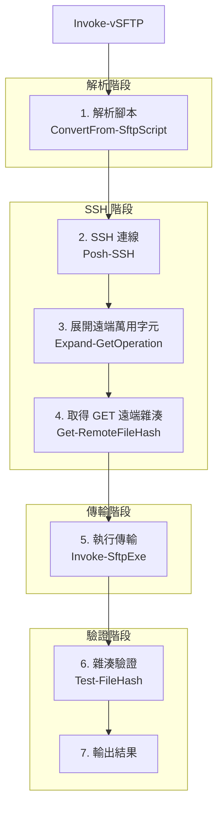

# vSFTP 設計文件

## 概述

vSFTP 是一個 PowerShell 工具，在 SFTP 傳輸後進行 SHA256 雜湊驗證。

## 架構



## 元件

### 1. ConvertFrom-SftpScript

解析 SFTP 批次腳本並提取檔案操作。

**輸入：** 腳本檔案路徑、基礎本地/遠端目錄
**輸出：** 傳輸操作陣列

```powershell
[PSCustomObject]@{
    Action       = "put" | "get"
    LocalPath    = "C:\data\file.txt"      # 絕對路徑
    RemotePath   = "/upload/file.txt"      # 絕對路徑
    IsWildcard   = $false                  # GET 萬用字元標記
}
```

**追蹤的指令：**
- `put <local> [remote]` - 加入傳輸清單
- `get <remote> [local]` - 加入傳輸清單
- `cd <path>` - 更新遠端工作目錄
- `lcd <path>` - 更新本地工作目錄

### 2. Expand-GetOperation

展開 GET 操作的遠端萬用字元。

```powershell
# 輸入: get *.log
# 透過 SSH 執行: ls /path/*.log
# 輸出: 展開為多個 GET 操作
```

### 3. Get-RemoteFileHash

透過 SSH 取得遠端檔案的 SHA256 雜湊。

**Linux：**
```bash
sha256sum /path/to/file | cut -d' ' -f1
```

**Windows：**
```powershell
powershell -NoProfile -Command "(Get-FileHash -Path 'C:\path' -Algorithm SHA256).Hash"
```

### 4. Invoke-SftpExe

使用原生 `sftp.exe` 執行實際傳輸。

### 5. Test-FileHash

比對本地與遠端雜湊，輸出驗證結果。

## 資料流程

### PUT 操作

```
1. 解析: put local.txt /remote/path/
   └─> {Action:put, Local:C:\data\local.txt, Remote:/remote/path/local.txt}

2. sftp.exe 執行傳輸

3. 透過 SSH 計算遠端雜湊
   └─> RemoteHash: ABC123...

4. 計算本地雜湊
   └─> LocalHash: ABC123...

5. 比對雜湊
   └─> 相符: ✓ [ABC123...]
```

### GET 操作

```
1. 解析: get *.log
   └─> {Action:get, Remote:/path/*.log, IsWildcard:true}

2. 展開萬用字元
   └─> access.log, error.log, debug.log

3. 傳輸前取得遠端雜湊
   └─> ExpectedHash: ABC123...

4. sftp.exe 執行傳輸

5. 計算本地雜湊
   └─> ActualHash: ABC123...

6. 比對雜湊
   └─> 相符: ✓ [ABC123...]
```

## 錯誤處理

| 錯誤類型 | 結束碼 | 行為 |
|----------|--------|------|
| 缺少環境變數 | 3 | 立即中止 |
| SSH 連線失敗 | 3 | 立即中止 |
| sftp.exe 失敗 | 2 | 中止（或使用 -ContinueOnError 繼續）|
| 雜湊不符 | 1 | 中止（或使用 -ContinueOnError 繼續）|
| 遠端雜湊指令失敗 | 1 | 中止（或使用 -ContinueOnError 繼續）|

## 環境變數

| 變數 | 必要 | 說明 |
|------|------|------|
| SFTP_HOST | ✓ | SFTP 伺服器主機 |
| SFTP_USER | ✓ | 使用者名稱 |
| SFTP_KEYFILE | ✓ | SSH 私鑰路徑 |
| SFTP_PORT | | 連接埠（預設 22）|

## 參數

| 參數 | 說明 |
|------|------|
| -ScriptFile | SFTP 批次腳本路徑 |
| -NoVerify | 跳過雜湊驗證 |
| -ContinueOnError | 驗證失敗時繼續 |
| -DryRun | 只解析不執行 |
| -SkipHostKeyCheck | 跳過主機金鑰驗證 |

## 限制

1. 不支援 `reput`/`reget`（續傳）
2. 不追蹤 `rm` 指令（若腳本刪除檔案，雜湊驗證可能失敗）
3. 需要同時使用 `sftp.exe` 和 Posh-SSH（雙重連線）
